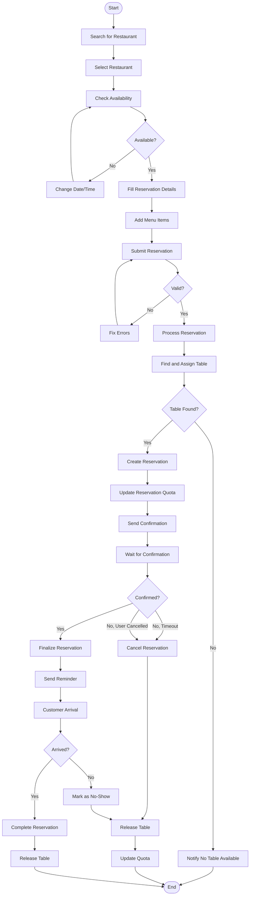

# Activity Diagram - Reservation Process

```mermaid
flowchart TD
    Start([Start]) --> SearchRestaurant[Search for Restaurant]
    SearchRestaurant --> SelectRestaurant[Select Restaurant]
    SelectRestaurant --> CheckAvailability[Check Availability]
    
    CheckAvailability --> AvailabilityDecision{Available?}
    AvailabilityDecision -->|No| ChangeDateTime[Change Date/Time]
    ChangeDateTime --> CheckAvailability
    
    AvailabilityDecision -->|Yes| FillReservationDetails[Fill Reservation Details]
    FillReservationDetails --> AddMenuItems[Add Menu Items]
    AddMenuItems --> SubmitReservation[Submit Reservation]
    
    SubmitReservation --> ValidationDecision{Valid?}
    ValidationDecision -->|No| FixErrors[Fix Errors]
    FixErrors --> SubmitReservation
    
    ValidationDecision -->|Yes| ProcessReservation[Process Reservation]
    ProcessReservation --> FindTable[Find and Assign Table]
    
    FindTable --> TableDecision{Table Found?}
    TableDecision -->|No| NotifyNoTable[Notify No Table Available]
    NotifyNoTable --> End([End])
    
    TableDecision -->|Yes| CreateReservation[Create Reservation]
    CreateReservation --> UpdateQuota[Update Reservation Quota]
    UpdateQuota --> SendConfirmation[Send Confirmation]
    SendConfirmation --> WaitForConfirmation[Wait for Confirmation]
    
    WaitForConfirmation --> ConfirmationDecision{Confirmed?}
    ConfirmationDecision -->|No, Timeout| CancelReservation[Cancel Reservation]
    ConfirmationDecision -->|No, User Cancelled| CancelReservation
    CancelReservation --> ReleaseTable[Release Table]
    ReleaseTable --> UpdateQuotaAfterCancel[Update Quota]
    UpdateQuotaAfterCancel --> End
    
    ConfirmationDecision -->|Yes| FinalizeReservation[Finalize Reservation]
    FinalizeReservation --> SendReminder[Send Reminder]
    SendReminder --> CustomerArrival[Customer Arrival]
    
    CustomerArrival --> ArrivalDecision{Arrived?}
    ArrivalDecision -->|No| MarkNoShow[Mark as No-Show]
    MarkNoShow --> ReleaseTable
    
    ArrivalDecision -->|Yes| CompleteReservation[Complete Reservation]
    CompleteReservation --> ReleaseTableAfterComplete[Release Table]
    ReleaseTableAfterComplete --> End
```
