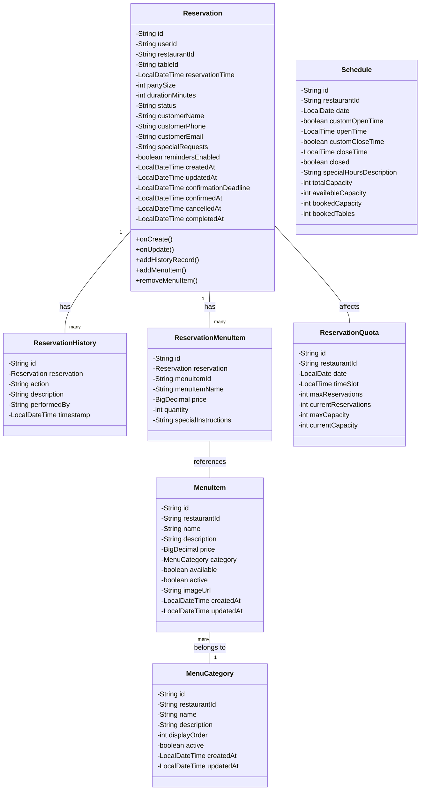

# Class Diagram - Restaurant Reservation System

```mermaid
classDiagram
    class Reservation {
        -String id
        -String userId
        -String restaurantId
        -String tableId
        -LocalDateTime reservationTime
        -int partySize
        -int durationMinutes
        -String status
        -String customerName
        -String customerPhone
        -String customerEmail
        -String specialRequests
        -boolean remindersEnabled
        -LocalDateTime createdAt
        -LocalDateTime updatedAt
        -LocalDateTime confirmationDeadline
        -LocalDateTime confirmedAt
        -LocalDateTime cancelledAt
        -LocalDateTime completedAt
        +onCreate()
        +onUpdate()
        +addHistoryRecord()
        +addMenuItem()
        +removeMenuItem()
    }

    class ReservationHistory {
        -String id
        -Reservation reservation
        -String action
        -String description
        -String performedBy
        -LocalDateTime timestamp
    }

    class ReservationMenuItem {
        -String id
        -Reservation reservation
        -String menuItemId
        -String menuItemName
        -BigDecimal price
        -int quantity
        -String specialInstructions
    }

    class MenuItem {
        -String id
        -String restaurantId
        -String name
        -String description
        -BigDecimal price
        -MenuCategory category
        -boolean available
        -boolean active
        -String imageUrl
        -LocalDateTime createdAt
        -LocalDateTime updatedAt
    }

    class MenuCategory {
        -String id
        -String restaurantId
        -String name
        -String description
        -int displayOrder
        -boolean active
        -LocalDateTime createdAt
        -LocalDateTime updatedAt
    }

    class Schedule {
        -String id
        -String restaurantId
        -LocalDate date
        -boolean customOpenTime
        -LocalTime openTime
        -boolean customCloseTime
        -LocalTime closeTime
        -boolean closed
        -String specialHoursDescription
        -int totalCapacity
        -int availableCapacity
        -int bookedCapacity
        -int bookedTables
    }

    class ReservationQuota {
        -String id
        -String restaurantId
        -LocalDate date
        -LocalTime timeSlot
        -int maxReservations
        -int currentReservations
        -int maxCapacity
        -int currentCapacity
    }

    Reservation "1" -- "many" ReservationHistory : has
    Reservation "1" -- "many" ReservationMenuItem : has
    ReservationMenuItem -- MenuItem : references
    MenuItem "many" -- "1" MenuCategory : belongs to
    Reservation -- ReservationQuota : affects
```
