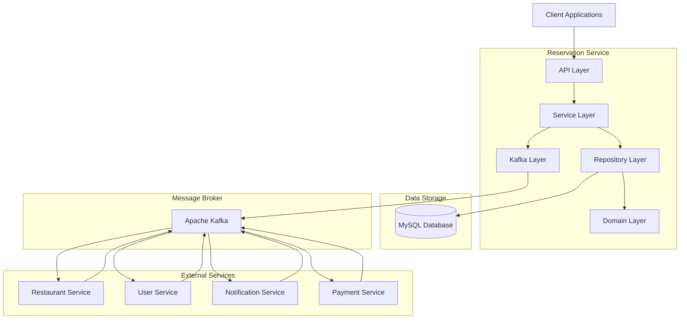

# Component Diagram - Restaurant Reservation System

```mermaid
graph TB
    subgraph "Reservation Service"
        API[API Layer]
        Service[Service Layer]
        Repository[Repository Layer]
        Domain[Domain Layer]
        Kafka[Kafka Layer]
        
        API --> Service
        Service --> Repository
        Repository --> Domain
        Service --> Kafka
    end
    
    subgraph "External Services"
        RestaurantService[Restaurant Service]
        UserService[User Service]
        NotificationService[Notification Service]
        PaymentService[Payment Service]
    end
    
    subgraph "Data Storage"
        Database[(MySQL Database)]
    end
    
    subgraph "Message Broker"
        KafkaBroker[Apache Kafka]
    end
    
    Client[Client Applications] --> API
    
    Repository --> Database
    Kafka --> KafkaBroker
    
    KafkaBroker --> RestaurantService
    KafkaBroker --> UserService
    KafkaBroker --> NotificationService
    KafkaBroker --> PaymentService
    
    RestaurantService --> KafkaBroker
    UserService --> KafkaBroker
    NotificationService --> KafkaBroker
    PaymentService --> KafkaBroker
```
