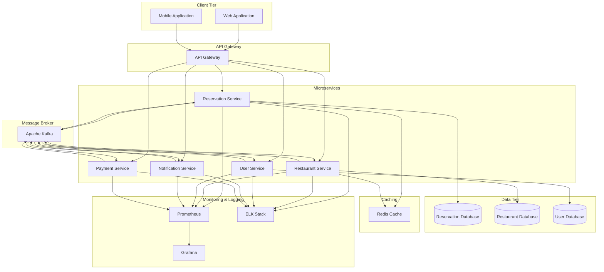

# Deployment Diagram - Restaurant Reservation System

```mermaid
flowchart TD
    subgraph "Client Tier"
        WebApp[Web Application]
        MobileApp[Mobile Application]
    end
    
    subgraph "API Gateway"
        Gateway[API Gateway]
    end
    
    subgraph "Microservices"
        ReservationService[Reservation Service]
        RestaurantService[Restaurant Service]
        UserService[User Service]
        NotificationService[Notification Service]
        PaymentService[Payment Service]
    end
    
    subgraph "Message Broker"
        Kafka[Apache Kafka]
    end
    
    subgraph "Data Tier"
        ReservationDB[(Reservation Database)]
        RestaurantDB[(Restaurant Database)]
        UserDB[(User Database)]
    end
    
    subgraph "Caching"
        Redis[Redis Cache]
    end
    
    subgraph "Monitoring & Logging"
        Prometheus[Prometheus]
        Grafana[Grafana]
        ELK[ELK Stack]
    end
    
    WebApp --> Gateway
    MobileApp --> Gateway
    
    Gateway --> ReservationService
    Gateway --> RestaurantService
    Gateway --> UserService
    Gateway --> NotificationService
    Gateway --> PaymentService
    
    ReservationService --> Kafka
    RestaurantService --> Kafka
    UserService --> Kafka
    NotificationService --> Kafka
    PaymentService --> Kafka
    
    Kafka --> ReservationService
    Kafka --> RestaurantService
    Kafka --> UserService
    Kafka --> NotificationService
    Kafka --> PaymentService
    
    ReservationService --> ReservationDB
    RestaurantService --> RestaurantDB
    UserService --> UserDB
    
    ReservationService --> Redis
    RestaurantService --> Redis
    
    ReservationService --> Prometheus
    RestaurantService --> Prometheus
    UserService --> Prometheus
    NotificationService --> Prometheus
    PaymentService --> Prometheus
    
    Prometheus --> Grafana
    ReservationService --> ELK
    RestaurantService --> ELK
    UserService --> ELK
    NotificationService --> ELK
    PaymentService --> ELK
```
