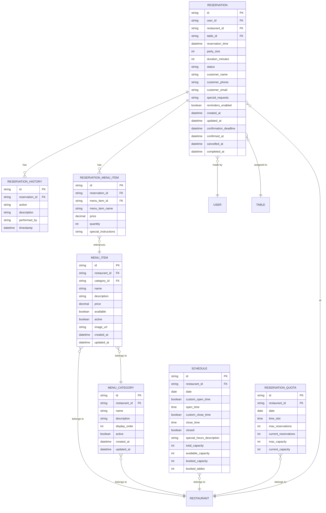

# Entity-Relationship Diagram - Restaurant Reservation System

```mermaid
erDiagram
    RESERVATION {
        string id PK
        string user_id FK
        string restaurant_id FK
        string table_id FK
        datetime reservation_time
        int party_size
        int duration_minutes
        string status
        string customer_name
        string customer_phone
        string customer_email
        string special_requests
        boolean reminders_enabled
        datetime created_at
        datetime updated_at
        datetime confirmation_deadline
        datetime confirmed_at
        datetime cancelled_at
        datetime completed_at
    }
    
    RESERVATION_HISTORY {
        string id PK
        string reservation_id FK
        string action
        string description
        string performed_by
        datetime timestamp
    }
    
    RESERVATION_MENU_ITEM {
        string id PK
        string reservation_id FK
        string menu_item_id FK
        string menu_item_name
        decimal price
        int quantity
        string special_instructions
    }
    
    MENU_ITEM {
        string id PK
        string restaurant_id FK
        string category_id FK
        string name
        string description
        decimal price
        boolean available
        boolean active
        string image_url
        datetime created_at
        datetime updated_at
    }
    
    MENU_CATEGORY {
        string id PK
        string restaurant_id FK
        string name
        string description
        int display_order
        boolean active
        datetime created_at
        datetime updated_at
    }
    
    SCHEDULE {
        string id PK
        string restaurant_id FK
        date date
        boolean custom_open_time
        time open_time
        boolean custom_close_time
        time close_time
        boolean closed
        string special_hours_description
        int total_capacity
        int available_capacity
        int booked_capacity
        int booked_tables
    }
    
    RESERVATION_QUOTA {
        string id PK
        string restaurant_id FK
        date date
        time time_slot
        int max_reservations
        int current_reservations
        int max_capacity
        int current_capacity
    }
    
    RESERVATION ||--o{ RESERVATION_HISTORY : "has"
    RESERVATION ||--o{ RESERVATION_MENU_ITEM : "has"
    RESERVATION_MENU_ITEM }o--|| MENU_ITEM : "references"
    MENU_ITEM }o--|| MENU_CATEGORY : "belongs to"
    MENU_ITEM }o--|| RESTAURANT : "belongs to"
    MENU_CATEGORY }o--|| RESTAURANT : "belongs to"
    SCHEDULE }o--|| RESTAURANT : "belongs to"
    RESERVATION_QUOTA }o--|| RESTAURANT : "belongs to"
    RESERVATION }o--|| USER : "made by"
    RESERVATION }o--|| RESTAURANT : "at"
    RESERVATION }o--|| TABLE : "assigned to"
```
