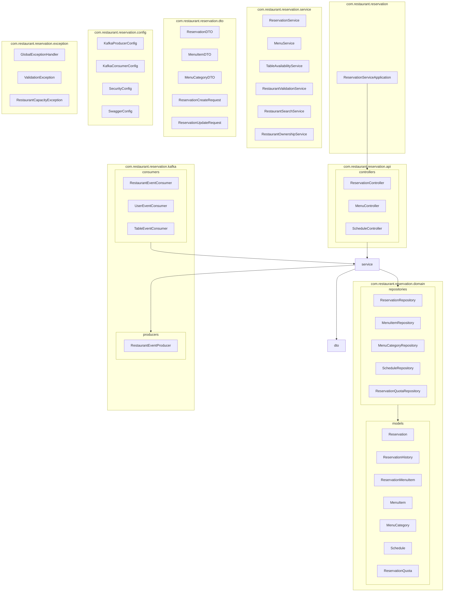

# Package Diagram - Reservation Service

```mermaid
flowchart TD
    subgraph "com.restaurant.reservation"
        App[ReservationServiceApplication]
    end
    
    subgraph "com.restaurant.reservation.api"
        subgraph "controllers"
            ReservationController[ReservationController]
            MenuController[MenuController]
            ScheduleController[ScheduleController]
        end
    end
    
    subgraph "com.restaurant.reservation.service"
        ReservationService[ReservationService]
        MenuService[MenuService]
        TableAvailabilityService[TableAvailabilityService]
        RestaurantValidationService[RestaurantValidationService]
        RestaurantSearchService[RestaurantSearchService]
        RestaurantOwnershipService[RestaurantOwnershipService]
    end
    
    subgraph "com.restaurant.reservation.domain"
        subgraph "models"
            Reservation[Reservation]
            ReservationHistory[ReservationHistory]
            ReservationMenuItem[ReservationMenuItem]
            MenuItem[MenuItem]
            MenuCategory[MenuCategory]
            Schedule[Schedule]
            ReservationQuota[ReservationQuota]
        end
        
        subgraph "repositories"
            ReservationRepository[ReservationRepository]
            MenuItemRepository[MenuItemRepository]
            MenuCategoryRepository[MenuCategoryRepository]
            ScheduleRepository[ScheduleRepository]
            ReservationQuotaRepository[ReservationQuotaRepository]
        end
    end
    
    subgraph "com.restaurant.reservation.dto"
        ReservationDTO[ReservationDTO]
        MenuItemDTO[MenuItemDTO]
        MenuCategoryDTO[MenuCategoryDTO]
        ReservationCreateRequest[ReservationCreateRequest]
        ReservationUpdateRequest[ReservationUpdateRequest]
    end
    
    subgraph "com.restaurant.reservation.kafka"
        subgraph "producers"
            RestaurantEventProducer[RestaurantEventProducer]
        end
        
        subgraph "consumers"
            RestaurantEventConsumer[RestaurantEventConsumer]
            UserEventConsumer[UserEventConsumer]
            TableEventConsumer[TableEventConsumer]
        end
    end
    
    subgraph "com.restaurant.reservation.config"
        KafkaProducerConfig[KafkaProducerConfig]
        KafkaConsumerConfig[KafkaConsumerConfig]
        SecurityConfig[SecurityConfig]
        SwaggerConfig[SwaggerConfig]
    end
    
    subgraph "com.restaurant.reservation.exception"
        GlobalExceptionHandler[GlobalExceptionHandler]
        ValidationException[ValidationException]
        RestaurantCapacityException[RestaurantCapacityException]
    end
    
    App --> controllers
    controllers --> service
    service --> repositories
    service --> producers
    repositories --> models
    consumers --> service
    service --> dto
```
