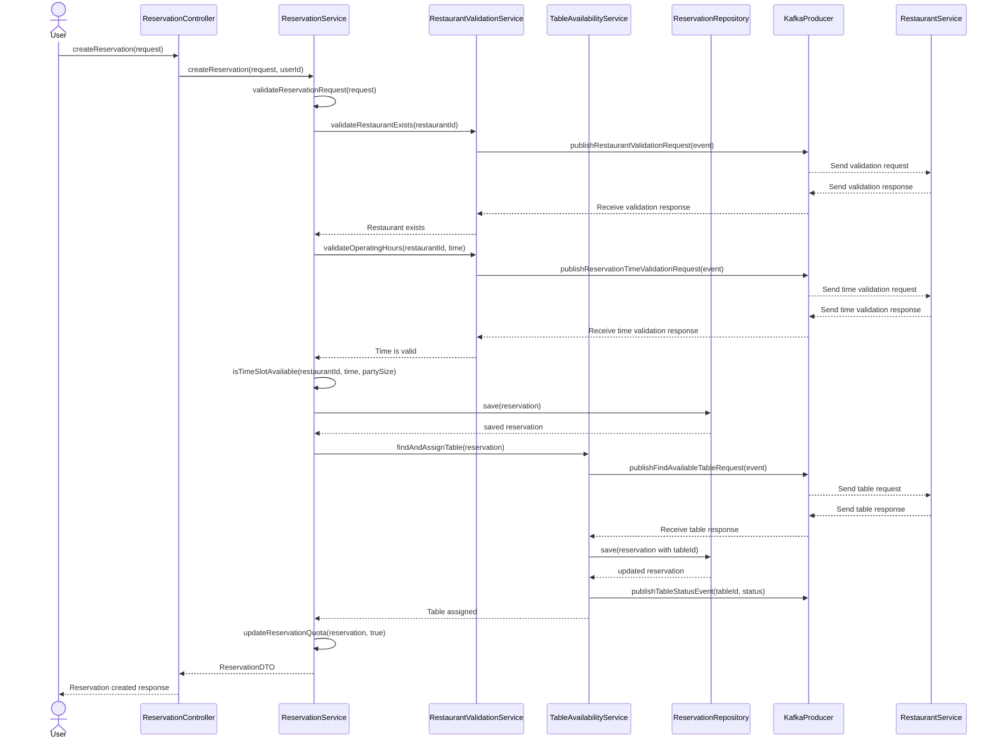

# Sequence Diagram - Reservation Creation Process

```mermaid
sequenceDiagram
    actor User
    participant ReservationController
    participant ReservationService
    participant RestaurantValidationService
    participant TableAvailabilityService
    participant ReservationRepository
    participant KafkaProducer
    participant RestaurantService
    
    User->>ReservationController: createReservation(request)
    ReservationController->>ReservationService: createReservation(request, userId)
    
    ReservationService->>ReservationService: validateReservationRequest(request)
    
    ReservationService->>RestaurantValidationService: validateRestaurantExists(restaurantId)
    RestaurantValidationService->>KafkaProducer: publishRestaurantValidationRequest(event)
    KafkaProducer-->>RestaurantService: Send validation request
    RestaurantService-->>KafkaProducer: Send validation response
    KafkaProducer-->>RestaurantValidationService: Receive validation response
    RestaurantValidationService-->>ReservationService: Restaurant exists
    
    ReservationService->>RestaurantValidationService: validateOperatingHours(restaurantId, time)
    RestaurantValidationService->>KafkaProducer: publishReservationTimeValidationRequest(event)
    KafkaProducer-->>RestaurantService: Send time validation request
    RestaurantService-->>KafkaProducer: Send time validation response
    KafkaProducer-->>RestaurantValidationService: Receive time validation response
    RestaurantValidationService-->>ReservationService: Time is valid
    
    ReservationService->>ReservationService: isTimeSlotAvailable(restaurantId, time, partySize)
    
    ReservationService->>ReservationRepository: save(reservation)
    ReservationRepository-->>ReservationService: saved reservation
    
    ReservationService->>TableAvailabilityService: findAndAssignTable(reservation)
    TableAvailabilityService->>KafkaProducer: publishFindAvailableTableRequest(event)
    KafkaProducer-->>RestaurantService: Send table request
    RestaurantService-->>KafkaProducer: Send table response
    KafkaProducer-->>TableAvailabilityService: Receive table response
    
    TableAvailabilityService->>ReservationRepository: save(reservation with tableId)
    ReservationRepository-->>TableAvailabilityService: updated reservation
    
    TableAvailabilityService->>KafkaProducer: publishTableStatusEvent(tableId, status)
    TableAvailabilityService-->>ReservationService: Table assigned
    
    ReservationService->>ReservationService: updateReservationQuota(reservation, true)
    
    ReservationService-->>ReservationController: ReservationDTO
    ReservationController-->>User: Reservation created response
```
