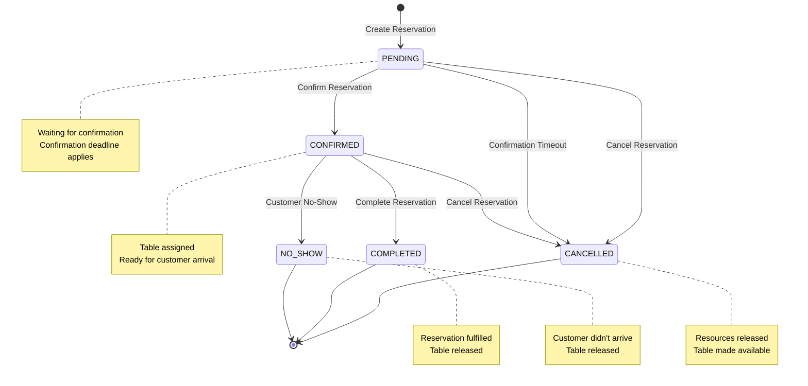

# State Diagram - Reservation Lifecycle

```mermaid
stateDiagram-v2
    [*] --> PENDING: Create Reservation
    
    PENDING --> CONFIRMED: Confirm Reservation
    PENDING --> CANCELLED: Cancel Reservation
    PENDING --> CANCELLED: Confirmation Timeout
    
    CONFIRMED --> CANCELLED: Cancel Reservation
    CONFIRMED --> COMPLETED: Complete Reservation
    CONFIRMED --> NO_SHOW: Customer No-Show
    
    CANCELLED --> [*]
    COMPLETED --> [*]
    NO_SHOW --> [*]
    
    note right of PENDING
        Waiting for confirmation
        Confirmation deadline applies
    end note
    
    note right of CONFIRMED
        Table assigned
        Ready for customer arrival
    end note
    
    note right of CANCELLED
        Resources released
        Table made available
    end note
    
    note right of COMPLETED
        Reservation fulfilled
        Table released
    end note
    
    note right of NO_SHOW
        Customer didn't arrive
        Table released
    end note
```
