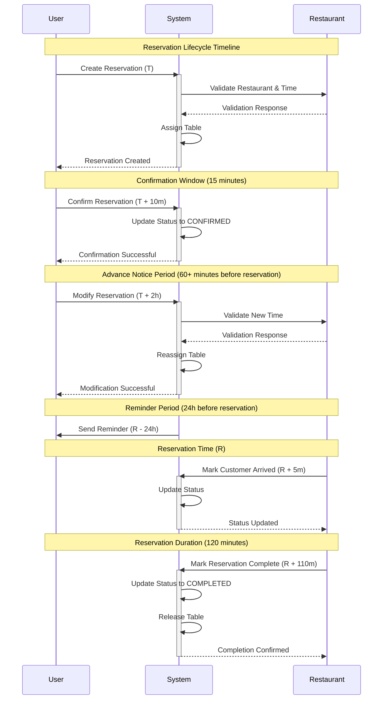

# Timing Diagram - Reservation Lifecycle

```mermaid
sequenceDiagram
    participant User
    participant System
    participant Restaurant
    
    Note over User,Restaurant: Reservation Lifecycle Timeline
    
    User->>System: Create Reservation (T)
    activate System
    System->>Restaurant: Validate Restaurant & Time
    Restaurant-->>System: Validation Response
    System->>System: Assign Table
    System-->>User: Reservation Created
    deactivate System
    
    Note over User,Restaurant: Confirmation Window (15 minutes)
    
    User->>System: Confirm Reservation (T + 10m)
    activate System
    System->>System: Update Status to CONFIRMED
    System-->>User: Confirmation Successful
    deactivate System
    
    Note over User,Restaurant: Advance Notice Period (60+ minutes before reservation)
    
    User->>System: Modify Reservation (T + 2h)
    activate System
    System->>Restaurant: Validate New Time
    Restaurant-->>System: Validation Response
    System->>System: Reassign Table
    System-->>User: Modification Successful
    deactivate System
    
    Note over User,Restaurant: Reminder Period (24h before reservation)
    
    System->>User: Send Reminder (R - 24h)
    
    Note over User,Restaurant: Reservation Time (R)
    
    Restaurant->>System: Mark Customer Arrived (R + 5m)
    activate System
    System->>System: Update Status
    System-->>Restaurant: Status Updated
    deactivate System
    
    Note over User,Restaurant: Reservation Duration (120 minutes)
    
    Restaurant->>System: Mark Reservation Complete (R + 110m)
    activate System
    System->>System: Update Status to COMPLETED
    System->>System: Release Table
    System-->>Restaurant: Completion Confirmed
    deactivate System
```
