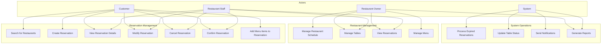

# Use Case Diagram - Restaurant Reservation System

```mermaid
graph TD
    subgraph "Actors"
        Customer[Customer]
        RestaurantOwner[Restaurant Owner]
        RestaurantStaff[Restaurant Staff]
        System[System]
    end
    
    subgraph "Reservation Management"
        UC1[Search for Restaurants]
        UC2[Create Reservation]
        UC3[View Reservation Details]
        UC4[Modify Reservation]
        UC5[Cancel Reservation]
        UC6[Confirm Reservation]
        UC7[Add Menu Items to Reservation]
    end
    
    subgraph "Restaurant Management"
        UC8[Manage Restaurant Schedule]
        UC9[Manage Tables]
        UC10[View Reservations]
        UC11[Manage Menu]
    end
    
    subgraph "System Operations"
        UC12[Process Expired Reservations]
        UC13[Update Table Status]
        UC14[Send Notifications]
        UC15[Generate Reports]
    end
    
    Customer --> UC1
    Customer --> UC2
    Customer --> UC3
    Customer --> UC4
    Customer --> UC5
    Customer --> UC6
    Customer --> UC7
    
    RestaurantOwner --> UC8
    RestaurantOwner --> UC9
    RestaurantOwner --> UC10
    RestaurantOwner --> UC11
    RestaurantOwner --> UC15
    
    RestaurantStaff --> UC3
    RestaurantStaff --> UC4
    RestaurantStaff --> UC5
    RestaurantStaff --> UC6
    RestaurantStaff --> UC9
    RestaurantStaff --> UC10
    
    System --> UC12
    System --> UC13
    System --> UC14
    System --> UC15
```
